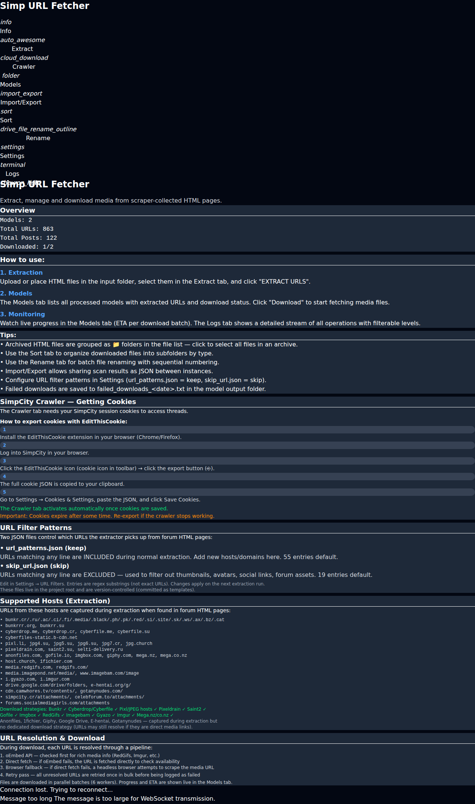
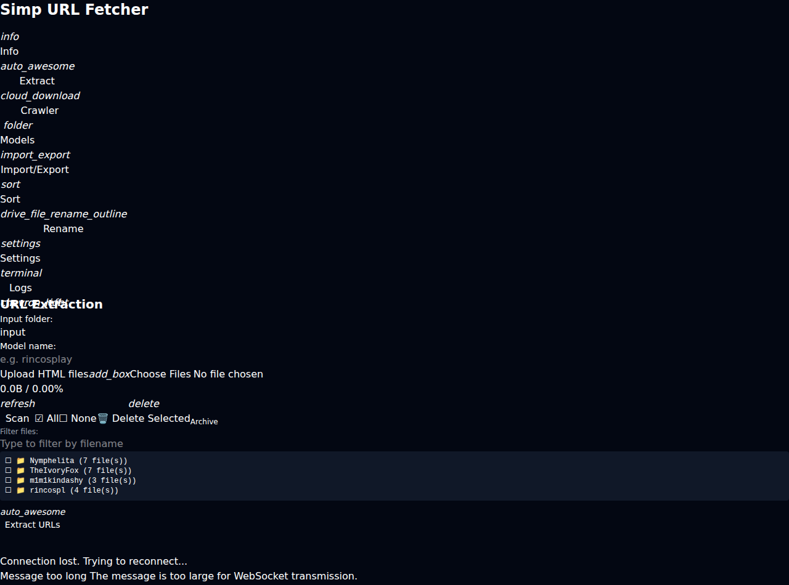
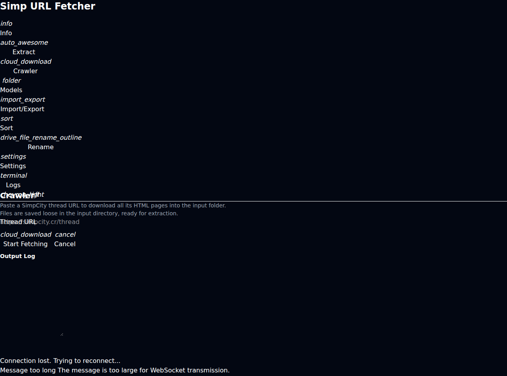
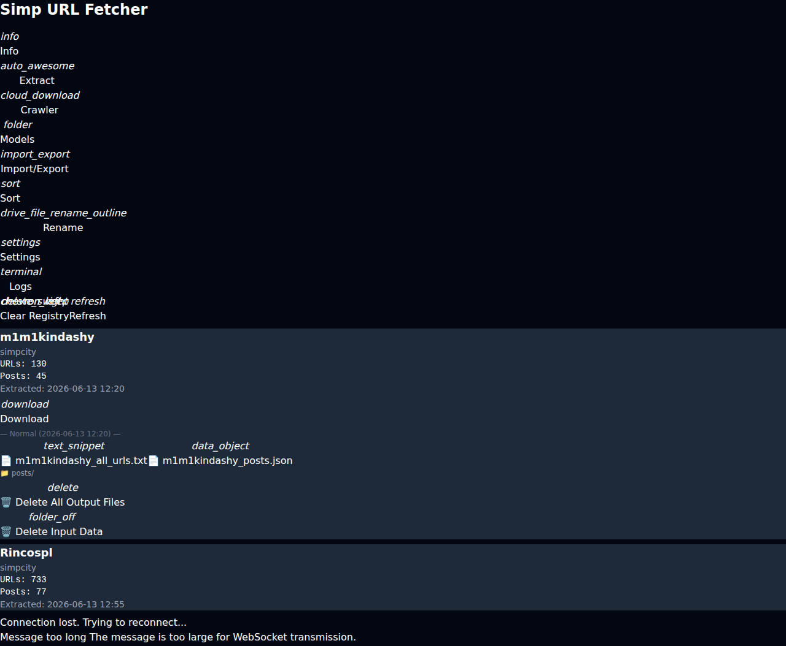
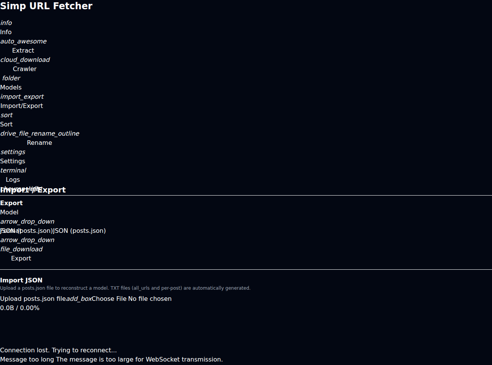
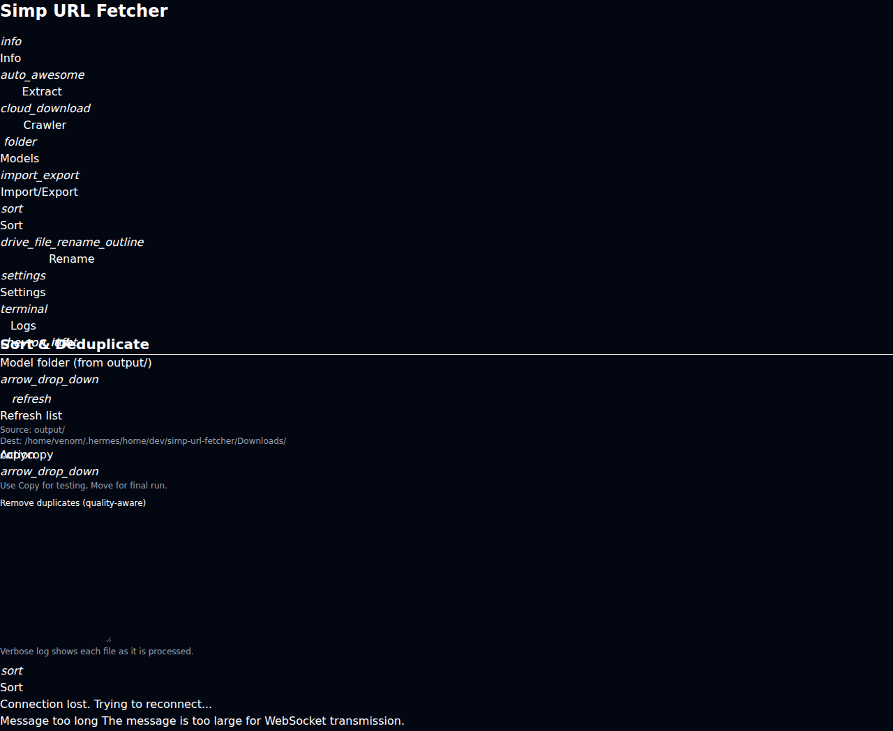
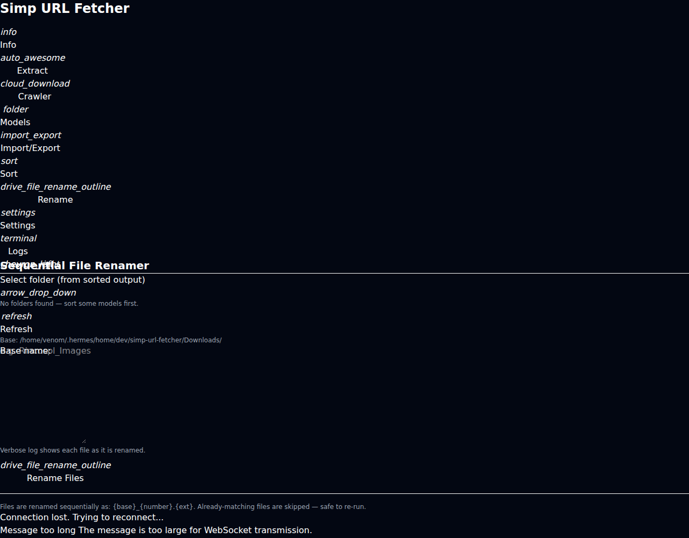
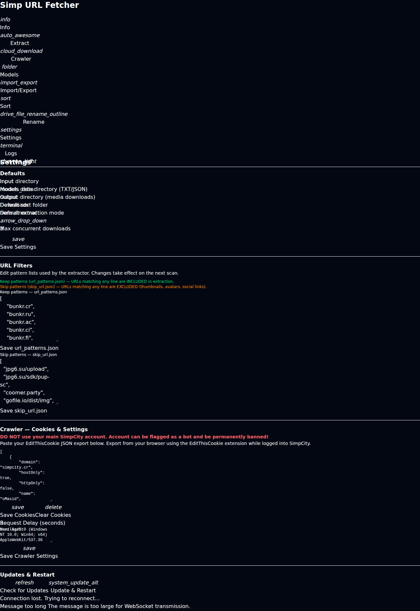
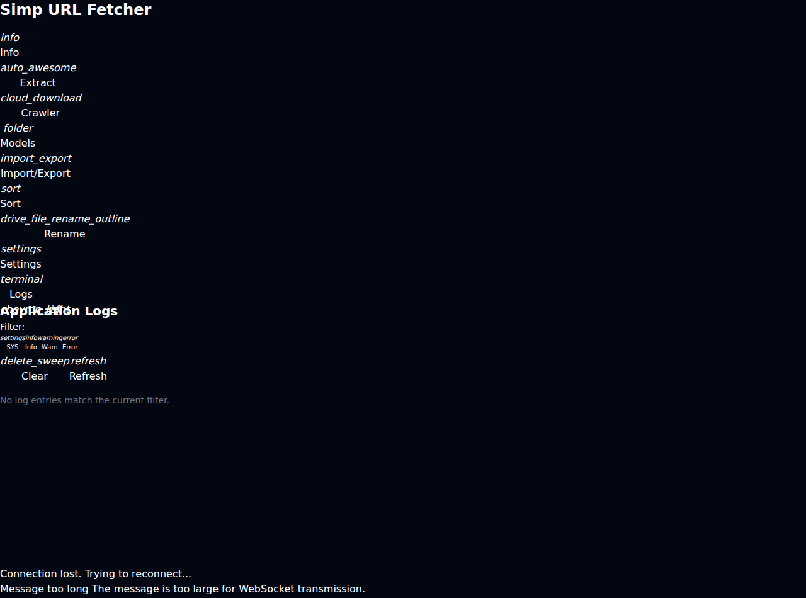

# Simp URL Fetcher

A **NiceGUI web application** for crawling SimpCity forum threads, extracting media URLs, managing parallel downloads, and organizing the resulting media — all from a browser.

> **Note:** There's also a **terminal/console version** of this project: [simp-console](https://github.com/v3nombyte/simp-console) — same core engine, CLI-first interaction.

## Quick Start

```bash
# 1. Install (venv + deps + Playwright browser + .env)
./install.sh

# 2. Launch the web app
./start.sh
```

Open **http://localhost:8080** in your browser.

> On MumPi (Raspberry Pi), the app runs as a systemd user service (`simp-url-fetcher.service`), auto-restarting on failure.

## Features

### Web UI — 9 Tabs

| Tab | Purpose |
|-----|---------|
| **Info** | Welcome walkthrough, system status, link to console version |
| **Extract** | Upload HTML files, scan input folders, extract URLs in 3 modes |
| **Crawler** | Fetch complete SimpCity thread pages (cookie auth) |
| **Models** | Model cards with extraction/download stats, live download progress |
| **Import/Export** | Share scan results as JSON between instances |
| **Sort** | Quality-aware dedup + media sorting by type |
| **Rename** | Sequential file renaming |
| **Settings** | Paths, concurrency, cookies, filter patterns |
| **Logs** | 4-level colour-coded log stream with filtering |

### Live Download Dashboard

When a download runs, the Models tab shows a persistent live panel with:

- **Header:** Model name, total URLs, completed count, total downloaded files + size, aggregate speed (5s rolling window), ETA
- **Host queue breakdown table:** Pending files per host with per-host file counts
- **Per-file progress bars:** 8 active workers showing filename, speed, progress percentage (thick Quasar linear progress bars)
- **Counters:** OK and failed file totals per host
- **Pre-resolution:** Next batch of URLs is resolved while the current batch downloads — no waiting between batches
- **State persistence:** The panel survives page reloads (registry-backed). Re-opening the page restores the last active download state

Completed downloads scroll off; the list always shows the next pending URLs.

### URL Extraction
- 3 extraction modes:
  - **Normal** — applies `url_patterns.json` + `skip_url.json` filters
  - **Reverse Filter** — excludes matching patterns (for discovering new domains)
  - **No Filter** — extracts everything
- Archive workflow: processed HTML files move to `input/{model}/` and display as grouped folders
- Model name auto-suggested from HTML content

### Thread Crawler
- Cookie-based SimpCity thread crawling with configurable delay
- Fetches all pages of a thread (detects total pages from pagination)
- Saves as `Title - Page N.html` into the input folder
- Editable User-Agent string

### Download Pipeline
- Parallel workers (configurable concurrency) with host-based rate limiting
- Host-specific resolution strategies (API, scrape, browser fallback)
- **Streaming resolution:** Next batch is pre-resolved while the current batch downloads
- **Host queue breakdown:** Per-host pending file counts shown in the dashboard
- **Aggregate speed tracking:** Total download speed across all active files (5s rolling window)
- **Configurable per-file speed throttle** (MB/s) — set per-file speed limit, 0 = unlimited
- Per-file byte-level progress reporting
- Retry pass for all failed URLs
- Failed URLs saved to file for later retry — includes mode/page/post context (Mode{mode}, model_name, page, post)
- **Existing files skipped** automatically — pre-request file existence check prevents re-download

### Sort & Dedupe
- SHA-256 exact duplicate detection (file-level)
- Perceptual hashing (image + video) for near-duplicate detection
- Sorts into `images/` and `videos/` subdirectories
- Unknown types → `unknown/`
- ZIP/RAR archives auto-extracted after download
- Graceful handling of moved/deleted source files

### Rename
- Sequential: `ModelName_001.ext`, `ModelName_002.ext`, …
- Preserves extensions, configurable output folder

### Model Registry
- JSON-backed, thread-safe database of all processed models
- Tracks extraction/download/sort/rename status
- On-disk file counts and sizes
- Download state persists across app restarts and page reloads

### Import / Export
- **Export** — TXT (URL list) or JSON (post-structured) per model
- **Import** — Load previously exported JSON results from any location
- **Select JSON** — Pick from existing `models_data/` exports

### Update System
- **Git-based update check** with commit log display
- Shows new commit messages in yellow monospace before applying
- **Branch selector dropdown** — switch between `main` and `dev` branches (shows remote tracking branches)
- One-click pull + automatic restart (`os._exit(1)` triggers systemd auto-restart)

### Settings

Configure in the **Settings** tab:

| Setting | Default | Description |
|---------|---------|-------------|
| Input directory | `input/` | HTML file location |
| Model data directory | `models_data/` | TXT/JSON export destination |
| Output directory | `output/` | Download destination |
| Sort directory | `~/Downloads` | Default for Sort tab |
| Max concurrent downloads | `3` | Parallel download workers |
| Request delay | `3.0s` | Seconds between crawl requests |
| Extraction mode | `normal` | Normal / Reverse / No Filter |
| Update branch | `main` | Git branch for updates |
| User-Agent | Mozilla/… | Browser UA string |
| Pixeldrain API Key | `.env` or Settings | `PIXELDRAIN_APIKEY` in `.env` or Settings → Host API Keys |
| Pixeldrain Cookie | `.env` or Settings | `PIXELDRAIN_COOKIES` or paste full EditThisCookie JSON in Settings → Host API Keys (hidden field, same UX as SimpCity cookie) — required for list/album ZIP downloads |
| Max Download Speed (MB/s) | `0` | Per-file download throttle in MB/s, 0 = unlimited |
| Streaming Resolve | `True` | Pre-resolve next batch of URLs while the current batch downloads |
| URL Filter patterns | (json) | Live-editable keep/skip lists |
| Cookies (JSON) | (hidden) | EditThisCookie export — **never displayed in cleartext** |

### Logging
- 4-level colour-coded log stream: SYS (grey), INFO (white), WARN (yellow), ERROR (red)
- Filterable by level in the Logs tab
- Also written to rotating files

## Installation

### Linux / MumPi (Raspberry Pi)

```bash
git clone https://github.com/v3nombyte/simp-url-fetcher.git
cd simp-url-fetcher
./install.sh
./start.sh
```

### Manual

```bash
python3 -m venv venv
source venv/bin/activate
pip install -r requirements.txt
python3 -m playwright install chromium
cp env.example .env
# Edit .env with credentials (optional)
python -c "from app import start_app; start_app()"
```

### systemd (MumPi)

```bash
# The app includes a systemd user service configuration
systemctl --user enable simp-url-fetcher.service
systemctl --user start simp-url-fetcher.service
# Logs: journalctl --user -u simp-url-fetcher -f
```

## Project Structure

```
├── app.py                   # Main NiceGUI web application
├── core/
│   ├── crawler.py           # SimpCity thread crawler
│   ├── downloader.py        # Async download pipeline
│   ├── exporter.py          # TXT/JSON export
│   ├── extractor.py         # HTML URL extraction
│   ├── models.py            # Settings model
│   ├── registry.py          # Thread-safe model registry
│   ├── renamer.py           # Sequential rename
│   └── sorter.py            # SHA-256 + perceptual dedup
├── install.sh               # One-command setup
├── start.sh                 # Launch script
├── url_patterns.json        # Keep patterns (extraction)
├── skip_url.json            # Skip patterns (extraction)
├── config/
│   └── settings.json        # User configuration (gitignored)
├── input/                   # HTML files (gitignored)
├── output/                  # Downloaded media (gitignored)
├── models_data/             # TXT/JSON exports (gitignored)
├── Downloads/               # Sorted media output (gitignored)
├── env.example              # Environment template
├── requirements.txt         # Python dependencies
├── models_registry.json     # Registry DB (gitignored)
├── screenshots/             # README preview images
└── scripts/                 # Utility scripts
```

## URL Filter Patterns

Two JSON files control extraction:

- **`url_patterns.json`** (keep) — URLs matching any entry are included. Ships with ~55 entries covering all common media hosts (Bunkr, Cyberdrop, GoFile, PixelDrain, image hosts, etc.)
- **`skip_url.json`** (skip) — URLs matching any entry are excluded. Ships with ~19 entries for thumbnails, avatars, social media, forum assets

Both are JSON arrays of regex substrings:
```json
["bunkr\\.cr", "cyberdrop\\.me", "gofile\\.io"]
```

Edit them live in **Settings → URL Filters** or directly in the project root.

### Extraction modes:
- **Normal** — keep + skip filters applied
- **Reverse Filter** — inverts keep patterns (extracts non-matching URLs — discover new hosts)
- **No Filter** — raw extraction of every URL

## Supported Hosts (Download)

| Host | Strategy | Status |
|------|----------|--------|
| Bunkr (bunkr.cr, bunkr.ru, bunkr.si, … 20+ variants) | Page scrape + Browser fallback | ✓ Tested |
| Cyberdrop / Cyberfile (me, su, cr, .si, …) | Page scrape + Browser fallback | ✓ Tested |
| jpg4.su, jpg5.su, jpg6.su, jpg7.cr, jpg.church, host.church | Chevereto oEmbed API | ✓ Tested |
| pixl.li, pixhost.to, imgbox.com | Referer header | ✓ Tested |
| imagebam.com, imagepond.net | Scrape / Referer | ✓ Tested |
| **pixeldrain.com** (individual files + `/l/` lists) | REST API | ✓ Tested |
| **gofile.io** | REST API (auth token forwarding) | ✓ Tested |
| redgifs.com | Scrape / Direct | ✓ Tested |
| mega.nz / mega.co.nz | `mega.py` library (AES decryption) | ✓ Tested |
| saint2.su, selti-delivery.ru | Direct URL mapping | ✓ Tested |
| i.imgur.com, i.gyazo.com, catbox, postimg | Direct passthrough | ✓ Tested |
| cdn.camwhores.tv, smg media | Direct passthrough | ✓ Tested |
| anonfiles.com, 1fichier.com, giphy.com | Generic HTTP fallback | ⚠️ Untested |
| drive.google.com, e-hentai.org, gotanynudes.com | Generic HTTP fallback | ⚠️ Untested |

## URL Resolution Pipeline

Each download URL goes through:

1. **Host-specific resolver** — API endpoint, page scrape, or oEmbed depending on host
2. **Album/list expansion** — PixelDrain `/l/` lists and CyberDrop `/a/` albums are expanded into individual file URLs automatically
3. **Direct fetch** — resolved URL is downloaded with referer/cookies as needed
4. **Browser fallback** — if direct fetch fails, headless Playwright Chromium attempts extraction
5. **Retry pass** — all failed URLs retried once in bulk
6. **Archive auto-extract** — ZIP/RAR files extracted after download

## Development

```bash
git clone https://github.com/v3nombyte/simp-url-fetcher
cd simp-url-fetcher
pip install -r requirements.txt
# Edit on dev branch
git checkout dev
# Push to dev, merge to main when stable
```

### Branch strategy
- **`main`** — stable, MumPi pulls this for daily use
- **`dev`** — experimental features (live panel, new host support, etc.)
- Switch via the branch selector dropdown in Settings

## Screenshots

| Tab | Preview |
|-----|---------|
| **Info** |  |
| **Extract** |  |
| **Crawler** |  |
| **Models** |  |
| **Import/Export** |  |
| **Sort** |  |
| **Rename** |  |
| **Settings** |  |
| **Logs** |  |

## Requirements

- Python 3.10+
- nicegui
- beautifulsoup4 + lxml
- requests
- Pillow
- mega.py
- Playwright + Chromium
- (See `requirements.txt` for full list)
